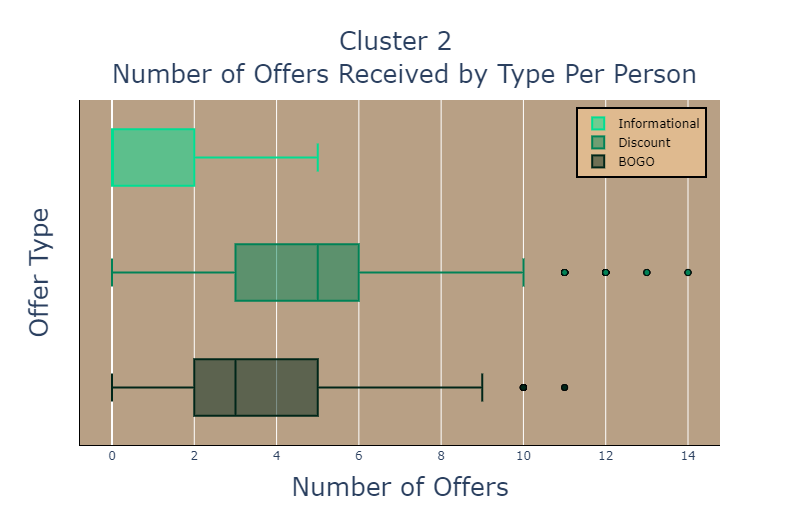

# Capstone

This project starts with a dataset of one month of Customer data from Starbucks app users.
There were three files:
+ Transcript - A list of offer interactions (receive/view/complete), and all other transactions during the test period.

+ Portfolio — Offers sent during the 30-day test period, via web, email, mobile or social media channels, or a combination thereof. The offers have varying levels of difficulty (minimum spend) and reward, and fall into one of three categories: Discount, Buy-one-get-one (BOGO), Informational

+ Customer profiles — their age, gender, income, and date of becoming a member.

# Goal 

Create an effective method for customer outreach for underperforming groups.  

# Action Plan

1.  Data Wrangling
2.  Data Exploration and Analysis - E.D.A.
3.  Principal Component Analysis
4.  K-Means Clustering
5.  Explore Differences in clusters
6.  Create an offer for each group to increase revenue
7.  Create model to predict weather an offer will be completed or viewed
8.  Predict how effective the proposed offers are

# The Beef

- Initial Data Wrangling and Some EDA can be found in:  **InitialDataWrangling.ipynb**
- Dead end Exploration:  **FalseStartEDA.ipynb**
- Full EDA and Initial Analysis: **EDA and Analysis.ipynb**
- Customer Segmentation and Clustering: **Segmentation.ipynb**
- Supervised Model and predictions: **Predicting.ipynb**

# Stopping to Smell the Roses (some preview pictures)
 
<h4> Cluster Analysis Income    </h4>
<ul style = "list-style-type:square">
    <li> Cluster 3 is the only significant outlier with noticably lower income    </li>
</ul>

 
   

 
     

  
<h4> Cluster Analysis Offer Types     </h4>
<ul style = "list-style-type:square">
    <li>  Cluster 2 received less informational and BOGO offers and the most discount offers  </li>
<li> Cluster 1 Received the most BOGO and informational offers  </li>
    <li> Cluster 3 received the lowest amount of offers   </li>
    <li> Cluster 0 and cluster 3 received an even number of BOGO and Discount offers </li>
</ul>
   
   
   
    

 
 
<h4> Offer Engagement  </h4>
<ul style = "list-style-type:square">
<li> Cluster 0 and 2 are our clear best customers, they complete a large percent of the offers they receive and view most of them  </li>
    <li> Cluster 3 barely views the offers and completes very few  </li>
    <li> Cluster 1 views a large amount of offers, but barely completes any  </li>
</ul>

     

 
  
 
